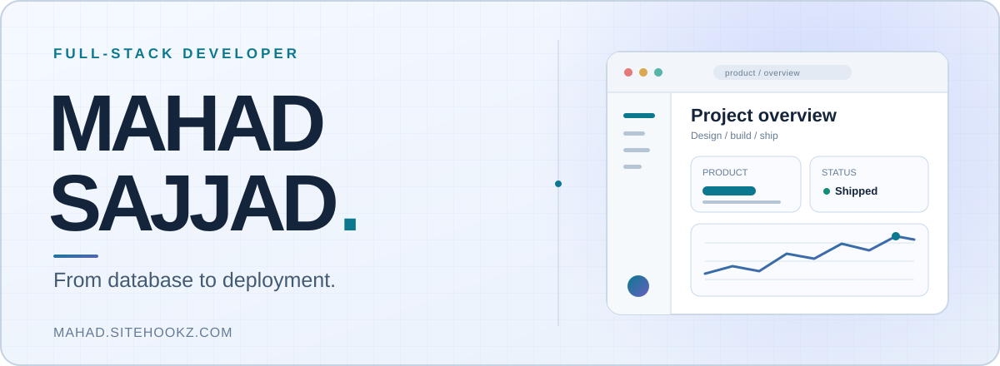

<picture>
  <source media="(prefers-color-scheme: dark)" srcset="./assets/dark.svg" />
  
</picture>

# Hi, I'm Mahad Sajjad

I'm a full-stack developer focused on turning ideas into useful web products. I build across the stack, from data models and APIs to interfaces and deployment. My work includes logistics software, point-of-sale systems, property platforms, and client websites.

**[Portfolio](https://mahadsajjad.vercel.app)** · **[Projects](https://mahadsajjad.vercel.app/projects)** · **[Email me](mailto:web.mahadsajjad787@gmail.com)**

## What I work on

- **Full-stack products:** dashboards, authentication, business workflows, and responsive interfaces.
- **Backend systems:** APIs, MongoDB data models, validation, and integrations.
- **Client projects:** translating business needs into working software and shipping it end to end.

## Selected projects

| Project                                             | What I built                                                                             | Stack                             |
| --------------------------------------------------- | ---------------------------------------------------------------------------------------- | --------------------------------- |
| [Transiqi](https://transiqi.netlify.app/auth/login) | Multilingual vehicle and logistics dashboard with expiry tracking and PDF/Excel exports. | MERN, Ant Design, i18n            |
| [POS System](https://fmse.vercel.app/)              | Inventory and sales system with product returns and expense tracking.                    | React, Bootstrap, Supabase        |
| [Get Set Properties](https://getsetproperties.com/) | Property listings, a management dashboard, and buyer inquiry flows.                      | React, Tailwind CSS, Supabase     |
| [Metafessional](https://metafessional.com/)         | Public website for my agency.                                                            | Next.js, shadcn/ui, Framer Motion |
| [Al Fajr](https://alfajrcontractingco.com/)         | Contracting company website with a Supabase-backed contact system.                       | React, Tailwind CSS, Supabase     |
| [Emirates Front](https://emiratesfront.com/)         | Contracting company website with a whatsapp base contact system.                       | React, Tailwind CSS, Whatsapp     |
| [The Elegance bedding UK](https://theelegancebedcompany.co.uk/)         |  Shopify store based in uk.                       | Shopify     |

See more work on [my portfolio](https://mahadsajjad.vercel.app/projects).

## Tools I use

- **Frontend:** JavaScript, TypeScript, React, Next.js, Tailwind CSS, Ant Design
- **Backend and data:** Node.js, Express, MongoDB, Supabase, Firebase, Zod
- **Workflow:** Git, Vercel, Antigravity

## Get in touch

I'm open to freelance and contract projects. Reach me through [email](mailto:web.mahadsajjad787@gmail.com), [LinkedIn](https://www.linkedin.com/in/mahad-sajjad-b34826337/), or [WhatsApp](https://wa.me/923244199929).
